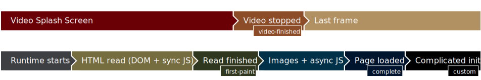

<!--
  Copyright 2021 Samsung Electronics. All rights reserved.
  Use of this source code is governed by a BSD-style license that can be
  found in the LICENSE file.
-->

# Video Splash Screen Demos

Video Splash Screen displays a short video while the application is loading and a static image after the video finished and the application is not loaded yet.

## Load timeline

The video terminates after one of the events below. You have to choose one of them for your application:

* `video-finished` — the application will be shown after the video has done playing
* `first-paint` — the application will be shown after the page has been loaded; \
this means the DOM structure, inline and synchronous script files
* `complete` — the application will be shown when it has finished fully loading; \
this means the DOM structure, inline, synchronous and asynchronous/deferred script files and all images; the `completed` event corresponds to JavaScript `window.onload` event
* `custom` — the application will not be shown until `window.screen.show()` method from JavaScript is called

## Examples in this repository:

To see, how to prepare a package with a widget, see [Using the examples](examples/usage.md).

|Example|Short description|
|-------|-----------------|
|[First&nbsp;paint](examples/01-first-paint)|The application screen should appear as the first paint of the page becomes available.|
|[First&nbsp;paint&nbsp;B](examples/01B-first-paint-defer)|Similar to "First paint", but it uses async scripts, some of which should still be loading after focus log.|
|[Completed&nbsp;load](examples/02-complete)|The application screen should appear with the `load` event.|
|[Completed&nbsp;load&nbsp;B](examples/02B-complete-defer)|Similar to "Completed load", but it uses async scripts, which introduces significant delay for the `load` event.|
[Video&nbsp;finished](examples/03-video-finished)|The `video-finished` event is received by the runtime, when the video is no longer playing.|
[Custom&nbsp;event](examples/04-custom)|The application screen should appear once the application calls `window.screen.show()`.|
[None](examples/00-none)|This example does not use Video Splash Screen.|

## Background music

For all examples (but the _None_ one) the background music in video files is sampled from "Bumbler" by Andy G. Cohen, released under [Creative Commons Attribution International Licence][cc-by-4.0] and downloaded from [Free Music Archive][FMA].

[][cc-by-4.0]

[cc-by-4.0]: https://creativecommons.org/licenses/by/4.0/
[FMA]: https://freemusicarchive.org/music/Andy_G_Cohen/Through_The_Lens/Andy_G_Cohen_-_Bumbler
