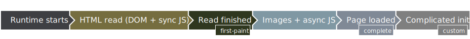

<!--
  Copyright 2021 Samsung Electronics. All rights reserved.
  Use of this source code is governed by a BSD-style license that can be
  found in the LICENSE file.
-->

# No video splash example

The application screen should appear as soon as the first paint of the page becomes available. The expected difference between `"Loaded"` and `"Focused"` logs should be miniscule.

If the application uses big images or `defer`, or `async` scripts, then the `"Loaded"` message can be logged after `"Focused"`.

The main difference between `none` and [`first-paint`](../01-first-paint) is, with [`first-paint`](../01-first-paint) a video should play at least partially, while with `none` a system graphical element should indicate loading. In a recent Tizen platforms, this would be a rotating progress circle with application name beneath it.

## Config changes

No config changes were made in this example.

## Using the example

To see, how to prepare a package with this widget, see [Using the examples](../usage.md) and use the [`00-none/widget`](widget) directory.
