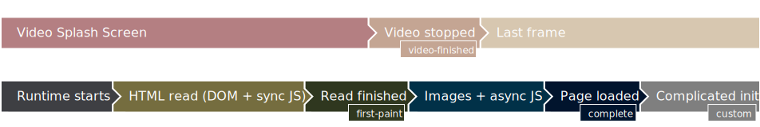

# Complete example

The application screen should appear with the `load` event. The expected difference between `"Loaded"` and `"Focused"` logs should be miniscule.



## Config changes

To get this behavior in your application, inside top-level `<widget>` element, at minimum add

```xml
<tizen:video_splash_screen ready_when="complete">
    <tizen:vss_default
        video="path-to-splash.mp4"
        background_image="path-to-background.png"
        background_color="#abcdef"
        image="path-to-splash.png"
        image_border="0px stretch" />
</tizen:video_splash_screen>
```

## Using the example

To see, how to prepare a package with this widget, see [Using the examples](../usage.md) and use the [`02-complete/widget`](widget) directory.
