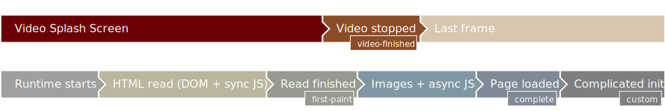

<!--
  Copyright 2021 Samsung Electronics. All rights reserved.
  Use of this source code is governed by a BSD-style license that can be
  found in the LICENSE file.
-->

# Video Finished example

The `video-finished` event is received by the runtime, when the video is no longer playing. The expected difference between `"Loaded"` and `"Focused"` logs is the length of the video, take away few hundreds milliseconds for application loading.




## Config changes

To get this behavior in your application, inside top-level `<widget>` element, at minimum add

```xml
<tizen:video_splash_screen ready_when="video-finished">
    <tizen:vss_default
        video="path-to-splash.mp4"
        background_image="path-to-background.png"
        background_color="#abcdef"
        image="path-to-splash.png"
        image_border="0px stretch" />
</tizen:video_splash_screen>
```

## Using the example

To see, how to prepare a package with this widget, see [Using the examples](../usage.md) and use the [`03-video-finished/widget`](widget) directory.
