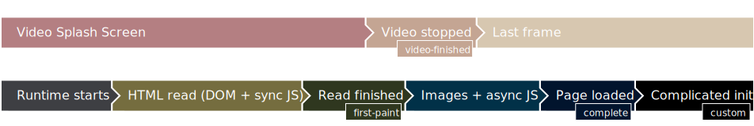

# Custom example

The application screen should appear once the application calls `window.screen.show()`, with `"Focused"` reported after `"Set up"` log.

The example emulates a complicated setup with a `setTimeout` waiting 10 seconds and only then calling `screeen.show()`.



## Config changes

To get this behavior in your application, inside top-level `<widget>` element, at minimum add

```xml
<tizen:video_splash_screen ready_when="custom">
    <tizen:vss_default
        video="path-to-splash.mp4"
        background_image="path-to-background.png"
        background_color="#abcdef"
        image="path-to-splash.png"
        image_border="0px stretch" />
</tizen:video_splash_screen>
```

## Using the example

To see, how to prepare a package with this widget, see [Using the examples](../usage.md) and use the [`04-custom/widget`](widget) directory.
