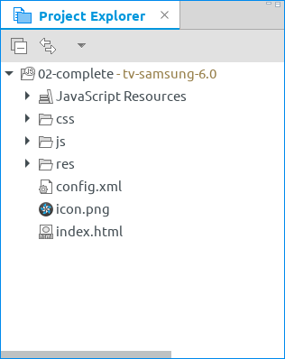

<!--
  Copyright 2021 Samsung Electronics. All rights reserved.
  Use of this source code is governed by a BSD-style license that can be
  found in the LICENSE file.
-->

# Using the examples

Each example directory has at least a readme and `widget` directory. That directory contains the files needed to build an example.

## Tizen Studio

In Tizen Studio go to _File_ &raquo; _Open Projects from File System..._ &raquo; _Directory..._, then navigate to the `widget` subdirectory of the desired example. Click _Finish_ and the example should be added to your Tizen Studio. Please note, the _project_ on the image below is caled `02-complete`, but it resides in the [`02-complete/widgets`](02-complete/widgets) directory.



Right-click the name of the project (in the example above, the line with `"02-complete"` and `"tv-samsung-6.0"`) and select _Build Signed Package_.

## Command line

If you prefer using Tizen CLI, navigate to `widget` subdirectory of and example and call

```sh
${SDK}/tools/ide/bin/tizen build-web -- .
${SDK}/tools/ide/bin/tizen package \
    -o . \
    -s ${SEC_PROFILE} \
    -t wgt \
    -- ..buildResult
```

where `${SDK}` is the directory your Tizen CLI is installed and `${SEC_PROFILE}` is the name of security profile you want use to sign the package (you can list the profiles in your SDK installation with `tizen security-profiles list` command).